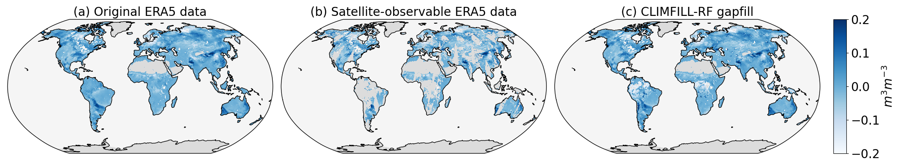

# CLIMFILL : A Framework for Intelligently Gap-filling Earth Observations

CLIMFILL fills gaps in gridded geoscientific observational data by taking into account spatial neighborhood, temporal context and multivariate dependencies. It takes a multivariate dataset with any number and pattern of missing values per variable and returns the dataset with all missing points replaced by estimates. CLIMFILL is a framework. Therefore, for each of the gap-filling steps taken, the user needs to find the best values for parameters, for example via cross-validation. A cross-validation workflow however already part of the package. For a full description of the framework, see [1].

CLIMFILL consists of four steps:

1. Interpolation: initially, the missing values are filled by spatial interpolation. In [1], this is done by dividing the data into monthly climatology, which are gapfilled using thin-plate-spline interpolation, and daily anomalies which are gapfilled using kriging. This procedure is adapted from [2] to increase computationally efficiency using adaptations described in [3].
2. Feature engineering: In the spirit of data science, in the second step descriptive features are created depending on the individual needs of the data. Most importantly, running means of important variables can be features to inform about slowly changing processes. Furthermore, time, and space, expressed in latitude and longitude, can be features. Helper functions to create such features are provided. 
3. Clustering: Before the last step, the data is divided into environmentally similar points accross space and time using `sklearn.cluster.MiniBatchKMeans`.
4. Regression learning: the initial gap-fill estimates from step 1 are iteratively updated by learning and applying `sklearn.ensemble.RandomForestRegressor` to the data using a method adapted from the MissForest Algorithm [4].

The necessary functions are in the respective scripts. An example workflow going through all four steps is shown in `example_workflow.py`.

## Installation

`pip install git+https://github.com/climachine/climfill`

## Documentation
For a full documentation, check [1]. Furthermore, each function and class has a doc string.

## Cautionary Notes
- Depending on the amount of the data, sometimes it is useful to save intermediate results and calculate the most expensive Step 4 for each cluster separately. This can reduce memory and CPU usage. The functions are written as such that they can easily be parallelised over the clusters or epochs.
- The package is very much work in progress. Any feedback is highly appreciated.

## License
The work is distributed under the Apache-2.0 License.

## References
- [1] Bessenbacher, V., Gudmundsson, L. and Seneviratne, S.I.: CLIMFILL: A Framework for Intelligently Gap-filling Earth Observations (resubmitted to Geoscientific Model Development on 10th January 2022) 
and references therein, especially
- [2] Haylock, M. R, Hofstra, N., Klein Tank, A. M. G., Klok, E. J., Jones, P. D. and New, M. (2008): A European daily high-resolution gridded data set of surface temperature and precipitation for 1950–2006. Journal of Geophysical Research: Atmospheres, 113, D20. DOI:10.1029/2008JD010201
- [3] Das, S., Roy, S. and Sambasivan, R. (2018): Fast Gaussian Process Regression for Big Data. Big Data Research, 14. DOI:10.1016/j.bdr.2018.06.002
- [4] Stekhoven, D. J. and Buehlmann, P. (2012): MissForest -- non-parametric missing value imputation for mixed-type data. Bioinformatics, 28, 1, 112-118. DOI:10.1093/bioinformatics/btr597
